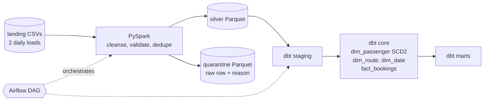
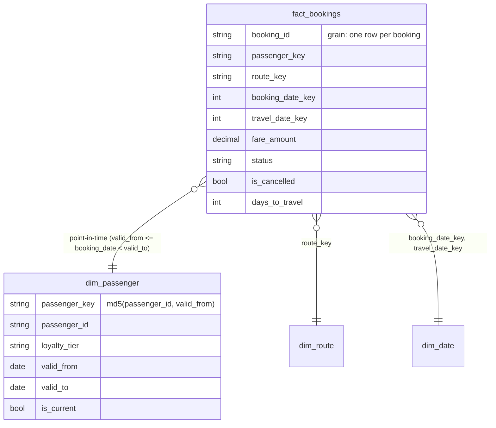

# lakehouse-kimball-pipeline

[](https://github.com/DruvaSaiKumar/lakehouse-kimball-pipeline/actions/workflows/ci.yml)

A small lakehouse pipeline: **PySpark cleanses and validates raw files into a silver layer, dbt models a Kimball star schema on top of it (with a Type 2 slowly changing dimension), and an Airflow DAG orchestrates the run.** Every stage is tested, and every rejected record is kept with a reason.

This is a personal portfolio project on synthetic airline-style booking data. It uses patterns from my data engineering work (layered warehouses, dimensional modelling, reconciliation, data quality), but contains no employer or client code or data.

## Architecture





| Layer | Where | What happens |
|---|---|---|
| Landing | `data/landing/` | Raw CSVs from two daily loads: bookings, passengers (day 1 full, day 2 changes only), routes |
| Silver | `pipeline/` | Trim and normalise text, cast types, apply rules, keep the latest version of each booking, drop duplicates, write Parquet. Rejects go to quarantine with a reason |
| Staging | `dbt/models/staging` | Typed views over silver Parquet (dbt-duckdb reads the files in place) |
| Core | `dbt/models/core` | Star schema: `fact_bookings`, `dim_passenger` (SCD2), `dim_route`, `dim_date`, each with an unknown member |
| Marts | `dbt/models/marts` | BI aggregates: daily route revenue, revenue by loyalty tier *at booking time* |

## Run it locally

Needs Python 3.10+. No Java required for this path.

```bash
pip install duckdb dbt-core~=1.9.0 dbt-duckdb~=1.9.0
python -m data_gen.generate --landing data/landing     # synthetic data with injected defects
python -m pipeline.run --engine duckdb                 # landing -> silver (+ quarantine, metrics)
cd dbt && dbt build --profiles-dir .                   # star schema + 29 data tests
```

With Java 17 and `pip install pyspark==3.5.3`, run the PySpark engine instead: `python -m pipeline.run --engine spark`.

## What the run finds

The generator injects a known number of each problem, and the tests assert the results exactly.

| Injected on day 2 | Count | Outcome |
|---|---|---|
| Negative fares | 15 | quarantined, `negative_fare` |
| Missing passenger id | 10 | quarantined, `missing_passenger_id` |
| Unparseable fare/date/timestamp values | 10 | quarantined, `malformed_value` |
| Unknown status (`BOGUS`) | 8 | quarantined, `invalid_status` |
| Unknown route | 8 | quarantined, `unknown_route` |
| Updates to day-1 bookings, and exact duplicates | 100 + 5 | latest version wins, 105 duplicates removed |
| Passengers with a changed tier or home airport | 30 | new SCD2 version, old one closed |
| Passengers re-sent with nothing changed | 10 | **no** new version |
| Bookings by passengers not in any extract | 12 | mapped to the unknown member, revenue still counted |

Result: 3,656 landing booking rows become 3,500 silver rows, 51 quarantined and 105 duplicates removed. `dim_passenger` has 350 real versions plus the unknown member. The identity `landing = silver + rejected + duplicates_removed` is tested.

## How it is tested

| Check | What it proves |
|---|---|
| `tests/test_silver.py` | Exact counts per reject reason, raw values preserved in quarantine, latest version wins, text cleaned, idempotent rebuild |
| `tests/test_star_schema.py` | Runs `dbt build` and checks version counts, no-op updates, contiguous windows, the point-in-time join recomputed independently, unknown members, marts reconcile to the fact |
| 29 dbt data tests | unique, not null, accepted values, relationships, plus custom tests: no overlapping SCD2 windows, one current row per passenger, fact reconciles to silver (count and total fare), known passengers never map to the unknown member |
| `tests/test_spark_parity.py` | The PySpark output equals the DuckDB reference **row for row**, in both directions, for every silver and quarantine table, and dbt builds an identical star schema from either |
| `tests_dag/` | The Airflow DAG imports with real Airflow, has the expected tasks and order, `catchup=False`, `max_active_runs=1`, retries on every task |

I also checked that the dbt integrity tests can fail: corrupting the warehouse on purpose (overlapping SCD2 windows, dropped fact rows) made all three affected tests fail.

### What ran where

| | Windows dev machine | GitHub Actions (Linux) |
|---|---|---|
| DuckDB silver, dbt build, all dbt tests, pytest | yes | yes |
| PySpark silver and the Spark-vs-DuckDB parity tests | **no** (PySpark needs Hadoop's `winutils` on Windows; skipped) | yes |
| Airflow DAG import test | no (Airflow does not run on Windows; an AST check covers the file) | yes |

## Layout

```
data_gen/      synthetic landing files with injected defects
pipeline/      silver layer: spark_silver.py (PySpark), duckdb_silver.py (reference), rules.py, run.py
dbt/           dbt project: staging, core (star schema), marts, tests, profiles
dags/          Airflow DAG: land -> spark_silver -> dbt_build -> dbt_docs_generate
tests/         pytest suite
tests_dag/     Airflow DAG integrity tests (run in CI)
docs/          design decisions
```

## Design highlights

Full reasoning in [docs/design-decisions.md](docs/design-decisions.md).

- **Two independent implementations of the silver rules** (Spark and DuckDB), compared row for row in CI.
- **SCD2 derived from the version history, not from a dbt snapshot**, so it is deterministic and rebuildable.
- **Point-in-time fact join** with half-open validity windows and a tested no-overlap guarantee.
- **Unknown members** for late-arriving dimensions instead of dropped rows.
- **Quarantine with reasons** and a tested accounting identity for every landing row.

## Limitations

- Silver is fully rebuilt each run; a production version would load incrementally by `load_date`.
- `land_raw_data` in the DAG regenerates synthetic files; real ingestion would replace it.
- Not run on Databricks or against a live Airflow deployment. The Spark code is plain PySpark.
- `dim_date` uses DuckDB's `generate_series`; other engines need their own date spine.

## License

MIT
