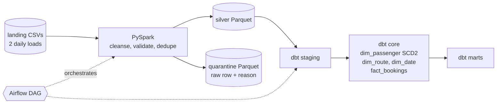
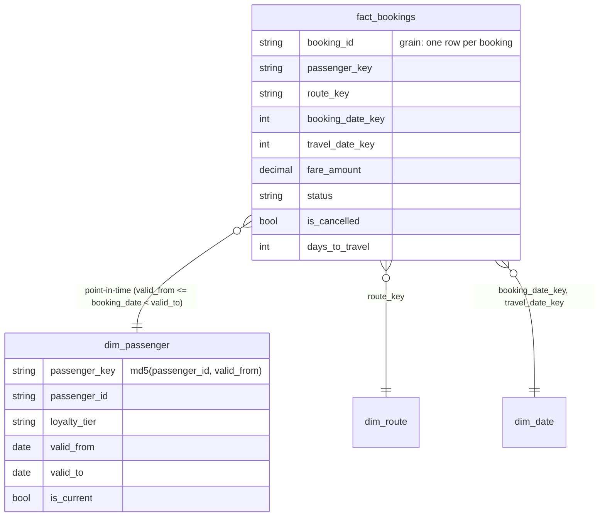

# lakehouse-kimball-pipeline

[](https://github.com/DruvaSaiKumar/lakehouse-kimball-pipeline/actions/workflows/ci.yml)

A small lakehouse pipeline on synthetic airline booking data. PySpark cleans and validates raw files into a silver layer, dbt builds a Kimball star schema on top (with a Type 2 slowly changing dimension), and an Airflow DAG runs the whole thing. Rejected records are kept with a reason instead of being dropped.


```mermaid
flowchart LR
    L[(landing CSVs<br/>2 daily loads)] --> S[PySpark<br/>cleanse, validate, dedupe]
    S --> V[(silver Parquet)]
    S --> Q[(quarantine Parquet<br/>raw row + reason)]
    V --> D[dbt staging]
    D --> C[dbt core<br/>dim_passenger SCD2<br/>dim_route, dim_date<br/>fact_bookings]
    C --> M[dbt marts]
    A{{Airflow DAG}} -.orchestrates.-> S
    A -.-> D
```


```mermaid
erDiagram
    fact_bookings }o--|| dim_passenger : "point-in-time (valid_from <= booking_date < valid_to)"
    fact_bookings }o--|| dim_route : route_key
    fact_bookings }o--|| dim_date : "booking_date_key, travel_date_key"
    fact_bookings {
        string booking_id "grain: one row per booking"
        string passenger_key
        string route_key
        int booking_date_key
        int travel_date_key
        decimal fare_amount
        string status
        bool is_cancelled
        int days_to_travel
    }
    dim_passenger {
        string passenger_key "md5(passenger_id, valid_from)"
        string passenger_id
        string loyalty_tier
        date valid_from
        date valid_to
        bool is_current
    }
```

## Layers

- **Landing** (`data/landing/`): raw CSVs from two daily loads. Bookings and routes as they arrive, and passengers as a full extract on day 1 and changes only on day 2.
- **Silver** (`pipeline/`): trims and normalizes text, casts types, applies the rules, keeps the latest version of each booking, drops duplicates and writes Parquet. Rejected rows go to quarantine with a reason.
- **Staging** (`dbt/models/staging`): typed views over the silver Parquet. dbt-duckdb reads the files in place.
- **Core** (`dbt/models/core`): `fact_bookings`, `dim_passenger` (SCD2), `dim_route` and `dim_date`, each with an unknown member.
- **Marts** (`dbt/models/marts`): daily route revenue, and revenue by loyalty tier at the time of booking.

## Running it

Needs Python 3.10+. This path doesn't need Java.

```bash
pip install duckdb dbt-core~=1.9.0 dbt-duckdb~=1.9.0
python -m data_gen.generate --landing data/landing     # synthetic data with injected defects
python -m pipeline.run --engine duckdb                 # landing -> silver (+ quarantine, metrics)
cd dbt && dbt build --profiles-dir .                   # star schema + 29 data tests
```

With Java 17 and `pip install pyspark==3.5.3` you can use the PySpark engine instead: `python -m pipeline.run --engine spark`.

## What the run finds

The generator injects a known number of each problem on day 2, and the tests assert the results exactly.

| Injected | Count | Outcome |
|---|---|---|
| Negative fares | 15 | quarantined, `negative_fare` |
| Missing passenger id | 10 | quarantined, `missing_passenger_id` |
| Unparseable fare, date or timestamp | 10 | quarantined, `malformed_value` |
| Unknown status (`BOGUS`) | 8 | quarantined, `invalid_status` |
| Unknown route | 8 | quarantined, `unknown_route` |
| Updates to day-1 bookings, plus exact duplicates | 100 + 5 | latest version wins, 105 duplicates removed |
| Passengers with a changed tier or home airport | 30 | new SCD2 version, old one closed |
| Passengers re-sent unchanged | 10 | no new version |
| Bookings by passengers missing from every extract | 12 | mapped to the unknown member, revenue still counted |

3,656 landing booking rows become 3,500 silver rows, with 51 quarantined and 105 duplicates removed. `dim_passenger` ends up with 350 real versions plus the unknown member. A test checks that `landing = silver + rejected + duplicates_removed`.

## Tests

- `tests/test_silver.py`: exact counts per reject reason, raw values kept in quarantine, latest version wins, an idempotent rebuild.
- `tests/test_star_schema.py`: runs `dbt build`, then checks version counts, unchanged updates, contiguous SCD2 windows, the point-in-time join recomputed independently, unknown members, and that the marts reconcile to the fact.
- 29 dbt data tests: unique, not null, accepted values and relationships, plus custom ones for overlapping SCD2 windows, one current row per passenger, the fact reconciling to silver, and known passengers never landing on the unknown member.
- `tests/test_spark_parity.py`: the PySpark output must match the DuckDB reference row for row, in both directions, for every silver and quarantine table, and dbt must build the same star schema from either.
- `tests_dag/`: the DAG imports under real Airflow, has the expected tasks and order, `catchup=False`, `max_active_runs=1`, and retries on every task.

I also checked that the dbt tests can actually fail. Corrupting the warehouse by hand (overlapping SCD2 windows, dropped fact rows) made all three affected tests fail.

On my Windows machine the DuckDB path, dbt and pytest all run. PySpark needs Hadoop's `winutils` on Windows and Airflow doesn't run there at all, so the Spark parity tests and the DAG import test are skipped locally (a static check covers the DAG file). GitHub Actions on Linux runs everything.

## Layout

```
data_gen/      synthetic landing files with injected defects
pipeline/      silver layer: spark_silver.py (PySpark), duckdb_silver.py (reference), rules.py, run.py
dbt/           staging, core (star schema), marts, tests, profiles
dags/          Airflow DAG: land -> spark_silver -> dbt_build -> dbt_docs_generate
tests/         pytest suite
tests_dag/     DAG integrity tests (run in CI)
docs/          design notes
```

## Design highlights

Reasoning is in [docs/design-decisions.md](docs/design-decisions.md).

- Two independent implementations of the silver rules (Spark and DuckDB), compared row for row in CI.
- SCD2 built from the version history instead of a dbt snapshot, so it's deterministic and rebuildable.
- Point-in-time fact join with half-open validity windows.
- Unknown members for late-arriving dimensions, instead of dropped rows.

## Limitations

- Silver is fully rebuilt on every run. At larger volumes it would load incrementally by `load_date`.
- `land_raw_data` in the DAG regenerates the synthetic files. Real ingestion would replace it.
- It hasn't run on Databricks or in a live Airflow deployment. The Spark code is plain PySpark.
- `dim_date` uses DuckDB's `generate_series`, so other engines need their own date spine.

MIT license.
